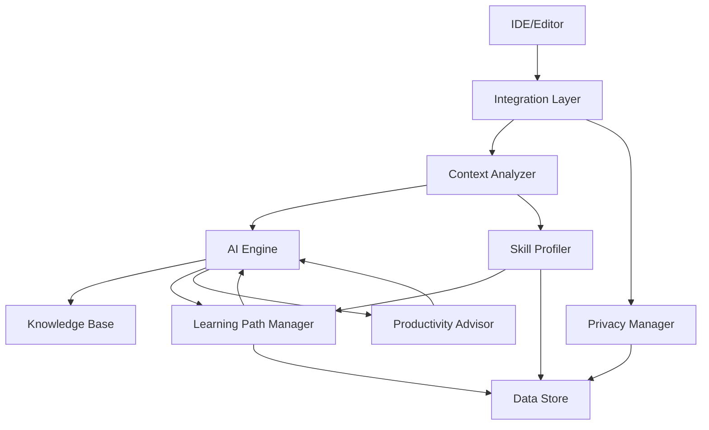

# Design Document: AI-Powered Learning & Developer Productivity

## Overview

This system provides an AI-powered learning and productivity platform integrated into the developer workflow. The architecture consists of several key components:

1. **AI Engine**: Core AI model that generates explanations, suggestions, and learning content
2. **Context Analyzer**: Extracts and processes code context, project structure, and developer interactions
3. **Learning Path Manager**: Creates and adapts personalized learning paths based on skill profiles
4. **Skill Profiler**: Tracks developer competencies and learning progress
5. **Productivity Advisor**: Analyzes code patterns and provides real-time suggestions
6. **Knowledge Base**: Stores code patterns, best practices, and educational content
7. **Integration Layer**: Connects with IDEs, editors, and development tools
8. **Privacy Manager**: Ensures secure handling of code and personal data

The system operates in real-time within the developer's environment, providing contextual assistance without disrupting workflow. It uses a combination of large language models, code analysis tools, and adaptive learning algorithms to deliver personalized experiences.

## Architecture

### High-Level Architecture



### Component Interactions

1. **Developer Action Flow**:
   - Developer interacts with code in IDE
   - Integration Layer captures events (code selection, typing, errors)
   - Context Analyzer extracts relevant code and project context
   - AI Engine processes request with context
   - Response delivered through Integration Layer to IDE

2. **Learning Session Flow**:
   - Developer initiates learning session
   - Learning Path Manager retrieves current path from Skill Profiler
   - AI Engine generates appropriate challenge
   - Developer attempts solution
   - AI Engine provides feedback and updates Skill Profiler
   - Learning Path Manager adjusts future content

3. **Productivity Suggestion Flow**:
   - Productivity Advisor monitors code changes
   - Context Analyzer provides code patterns and project conventions
   - AI Engine generates suggestions based on Knowledge Base
   - Suggestions presented non-intrusively in IDE
   - Accepted suggestions update Skill Profiler

## Components and Interfaces

### AI Engine

**Responsibilities**:
- Generate code explanations at multiple depth levels
- Create interactive learning challenges
- Provide real-time feedback on code
- Analyze errors and suggest fixes
- Generate documentation and architectural overviews

**Interface**:
```typescript
interface AIEngine {
  generateExplanation(
    code: CodeSegment,
    context: CodeContext,
    depth: ExplanationDepth
  ): Promise<Explanation>;
  
  createChallenge(
    skillProfile: SkillProfile,
    topic: Topic
  ): Promise<Challenge>;
  
  provideFeedback(
    code: CodeSegment,
    challenge: Challenge,
    attempt: number
  ): Promise<Feedback>;
  
  analyzeError(
    error: Error,
    code: CodeSegment,
    context: CodeContext
  ): Promise<ErrorAnalysis>;
  
  generateDocumentation(
    code: CodeSegment,
    context: CodeContext,
    style: DocumentationStyle
  ): Promise<Documentation>;
  
  identifyPatterns(
    code: CodeSegment,
    context: CodeContext
  ): Promise<Pattern[]>;
}

type ExplanationDepth = 'beginner' | 'intermediate' | 'advanced';
type DocumentationStyle = 'inline' | 'comprehensive' | 'api-reference';
```

### Context Analyzer

**Responsibilities**:
- Extract code segments and surrounding context
- Analyze project structure and dependencies
- Identify relevant documentation and comments
- Track developer interaction patterns
- Maintain session state

**Interface**:
```typescript
interface ContextAnalyzer {
  extractContext(
    selection: CodeSelection,
    project: Project
  ): CodeContext;
  
  analyzeProjectStructure(
    project: Project
  ): ProjectStructure;
  
  identifyDependencies(
    code: CodeSegment
  ): Dependency[];
  
  trackInteraction(
    event: DeveloperEvent
  ): void;
  
  getSessionState(): SessionState;
}

interface CodeContext {
  selectedCode: CodeSegment;
  surroundingCode: CodeSegment;
  imports: Import[];
  dependencies: Dependency[];
  projectStructure: ProjectStructure;
  language: Language;
  framework?: Framework;
}
```

### Learning Path Manager

**Responsibilities**:
- Generate personalized learning paths
- Adapt paths based on progress and performance
- Sequence topics from foundational to advanced
- Insert prerequisite or advanced content dynamically
- Track completion and mastery

**Interface**:
```typescript
interface LearningPathManager {
  generatePath(
    goals: LearningGoal[],
    skillProfile: SkillProfile
  ): LearningPath;
  
  updatePath(
    path: LearningPath,
    progress: Progress,
    performance: Performance
  ): LearningPath;
  
  getNextActivity(
    path: LearningPath
  ): LearningActivity;
  
  insertPrerequisites(
    path: LearningPath,
    topic: Topic
  ): LearningPath;
  
  skipRedundantContent(
    path: LearningPath,
    masteredTopics: Topic[]
  ): LearningPath;
}

interface LearningPath {
  id: string;
  goals: LearningGoal[];
  activities: LearningActivity[];
  currentPosition: number;
  estimatedCompletion: Date;
}
```

### Skill Profiler

**Responsibilities**:
- Conduct initial skill assessments
- Track competencies and progress
- Identify strengths and gaps
- Update profiles based on activities and code analysis
- Generate skill summaries and reports

**Interface**:
```typescript
interface SkillProfiler {
  conductAssessment(
    developer: Developer
  ): Promise<SkillProfile>;
  
  updateProfile(
    profile: SkillProfile,
    activity: CompletedActivity
  ): SkillProfile;
  
  analyzeCode(
    code: CodeSegment,
    profile: SkillProfile
  ): SkillInsights;
  
  getSkillSummary(
    profile: SkillProfile
  ): SkillSummary;
  
  identifyGaps(
    profile: SkillProfile,
    goals: LearningGoal[]
  ): SkillGap[];
}

interface SkillProfile {
  developerId: string;
  competencies: Map<Skill, ProficiencyLevel>;
  strengths: Skill[];
  gaps: SkillGap[];
  progressTrends: ProgressTrend[];
  lastUpdated: Date;
}

type ProficiencyLevel = 'novice' | 'beginner' | 'intermediate' | 'advanced' | 'expert';
```

### Productivity Advisor

**Responsibilities**:
- Monitor code changes in real-time
- Detect code smells and anti-patterns
- Suggest improvements and refactorings
- Recommend library functions and APIs
- Apply accepted suggestions

**Interface**:
```typescript
interface ProductivityAdvisor {
  analyzeCode(
    code: CodeSegment,
    context: CodeContext
  ): Promise<Suggestion[]>;
  
  detectCodeSmells(
    code: CodeSegment
  ): CodeSmell[];
  
  suggestRefactoring(
    codeSmell: CodeSmell,
    context: CodeContext
  ): RefactoringSuggestion;
  
  recommendLibraries(
    code: CodeSegment,
    context: CodeContext
  ): LibraryRecommendation[];
  
  applySuggestion(
    suggestion: Suggestion,
    code: CodeSegment
  ): CodeSegment;
}

interface Suggestion {
  id: string;
  type: SuggestionType;
  description: string;
  explanation: string;
  before: CodeSegment;
  after: CodeSegment;
  confidence: number;
}

type SuggestionType = 'refactoring' | 'library' | 'idiom' | 'performance' | 'readability';
```

### Knowledge Base

**Responsibilities**:
- Store code patterns and design patterns
- Maintain best practices by language and framework
- Index educational content and examples
- Provide pattern matching and retrieval
- Update with new patterns and practices

**Interface**:
```typescript
interface KnowledgeBase {
  findPatterns(
    code: CodeSegment,
    language: Language
  ): Pattern[];
  
  getBestPractices(
    language: Language,
    framework?: Framework
  ): BestPractice[];
  
  getExamples(
    pattern: Pattern
  ): CodeExample[];
  
  searchContent(
    query: string,
    filters: SearchFilters
  ): SearchResult[];
  
  addPattern(
    pattern: Pattern
  ): void;
}

interface Pattern {
  id: string;
  name: string;
  category: PatternCategory;
  description: string;
  intent: string;
  applicability: string[];
  structure: string;
  examples: CodeExample[];
  relatedPatterns: string[];
}

type PatternCategory = 'design' | 'architectural' | 'algorithm' | 'idiom' | 'anti-pattern';
```

### Integration Layer

**Responsibilities**:
- Connect with IDEs and editors via extensions
- Capture developer events (selections, edits, errors)
- Display explanations and suggestions in UI
- Handle user interactions with AI features
- Manage extension lifecycle

**Interface**:
```typescript
interface IntegrationLayer {
  initialize(
    ide: IDE,
    config: IntegrationConfig
  ): Promise<void>;
  
  captureEvent(
    event: DeveloperEvent
  ): void;
  
  displayExplanation(
    explanation: Explanation,
    position: Position
  ): void;
  
  displaySuggestion(
    suggestion: Suggestion,
    position: Position
  ): void;
  
  showLearningPanel(
    content: LearningContent
  ): void;
  
  registerCommand(
    command: Command,
    handler: CommandHandler
  ): void;
}

interface DeveloperEvent {
  type: EventType;
  timestamp: Date;
  selection?: CodeSelection;
  edit?: CodeEdit;
  error?: Error;
  metadata: Record<string, any>;
}

type EventType = 'selection' | 'edit' | 'error' | 'command' | 'save' | 'debug';
```

### Privacy Manager

**Responsibilities**:
- Enforce privacy settings and policies
- Encrypt sensitive data at rest and in transit
- Handle data deletion requests
- Manage consent and permissions
- Provide private mode operation

**Interface**:
```typescript
interface PrivacyManager {
  enforcePolicy(
    data: any,
    settings: PrivacySettings
  ): ProcessedData;
  
  encrypt(
    data: any
  ): EncryptedData;
  
  decrypt(
    encrypted: EncryptedData
  ): any;
  
  deleteUserData(
    developerId: string
  ): Promise<void>;
  
  checkConsent(
    developerId: string,
    operation: Operation
  ): boolean;
  
  enablePrivateMode(): void;
  
  disablePrivateMode(): void;
}

interface PrivacySettings {
  shareCode: boolean;
  storeLearningData: boolean;
  allowTelemetry: boolean;
  dataRetentionDays: number;
  privateMode: boolean;
}
```

## Data Models

### Core Data Structures

```typescript
// Code representation
interface CodeSegment {
  content: string;
  language: Language;
  startLine: number;
  endLine: number;
  filePath: string;
  ast?: AST;
}

interface CodeSelection {
  segment: CodeSegment;
  cursorPosition: Position;
  project: Project;
}

// Learning structures
interface Challenge {
  id: string;
  topic: Topic;
  difficulty: DifficultyLevel;
  description: string;
  starterCode?: string;
  testCases: TestCase[];
  hints: Hint[];
  timeEstimate: number;
}

interface Feedback {
  correct: boolean;
  score: number;
  strengths: string[];
  improvements: string[];
  explanation: string;
  nextSteps: string[];
}

interface LearningActivity {
  id: string;
  type: ActivityType;
  topic: Topic;
  difficulty: DifficultyLevel;
  estimatedTime: number;
  prerequisites: string[];
  content: any;
}

type ActivityType = 'challenge' | 'tutorial' | 'reading' | 'project' | 'quiz';
type DifficultyLevel = 'beginner' | 'intermediate' | 'advanced' | 'expert';

// Progress tracking
interface Progress {
  activityId: string;
  completed: boolean;
  score: number;
  timeSpent: number;
  attempts: number;
  completedAt?: Date;
}

interface Performance {
  accuracy: number;
  speed: number;
  consistency: number;
  improvementRate: number;
}

interface ProgressTrend {
  skill: Skill;
  dataPoints: DataPoint[];
  trend: 'improving' | 'stable' | 'declining';
}

// Explanations and documentation
interface Explanation {
  summary: string;
  sections: ExplanationSection[];
  depth: ExplanationDepth;
  codeHighlights: CodeHighlight[];
  relatedConcepts: Concept[];
}

interface ExplanationSection {
  title: string;
  content: string;
  codeExamples?: CodeExample[];
}

interface Documentation {
  overview: string;
  usage: string;
  parameters?: Parameter[];
  returns?: ReturnValue;
  examples: CodeExample[];
  notes?: string[];
}

// Patterns and suggestions
interface CodeSmell {
  type: string;
  severity: 'low' | 'medium' | 'high';
  location: CodeLocation;
  description: string;
  impact: string;
}

interface RefactoringSuggestion extends Suggestion {
  pattern: Pattern;
  benefits: string[];
  tradeoffs: string[];
}

// Error analysis
interface ErrorAnalysis {
  error: Error;
  rootCause: string;
  explanation: string;
  relatedConcepts: Concept[];
  suggestedFix: CodeSegment;
  preventionTips: string[];
}

// Skills and competencies
interface Skill {
  id: string;
  name: string;
  category: SkillCategory;
  description: string;
  prerequisites: string[];
}

type SkillCategory = 'language' | 'framework' | 'algorithm' | 'design' | 'tool' | 'concept';

interface SkillGap {
  skill: Skill;
  currentLevel: ProficiencyLevel;
  targetLevel: ProficiencyLevel;
  priority: 'low' | 'medium' | 'high';
  recommendedActivities: LearningActivity[];
}

interface SkillSummary {
  overallLevel: ProficiencyLevel;
  competencies: Map<Skill, ProficiencyLevel>;
  recentProgress: Progress[];
  strengths: Skill[];
  focusAreas: SkillGap[];
  achievements: Achievement[];
}

// Analytics
interface Metric {
  name: string;
  value: number;
  unit: string;
  timestamp: Date;
}

interface Achievement {
  id: string;
  title: string;
  description: string;
  earnedAt: Date;
  icon: string;
}
```

### Data Flow

1. **Code Explanation Flow**:
   ```
   Developer selects code → Integration Layer captures selection →
   Context Analyzer extracts context → AI Engine generates explanation →
   Integration Layer displays explanation
   ```

2. **Learning Session Flow**:
   ```
   Developer starts session → Learning Path Manager gets next activity →
   AI Engine creates challenge → Developer attempts solution →
   AI Engine provides feedback → Skill Profiler updates profile →
   Progress persisted to Data Store
   ```

3. **Productivity Suggestion Flow**:
   ```
   Developer writes code → Productivity Advisor analyzes →
   Knowledge Base provides patterns → AI Engine generates suggestions →
   Integration Layer displays suggestions → Developer accepts/rejects →
   Skill Profiler updates based on interaction
   ```

## Correctness Properties

*A property is a characteristic or behavior that should hold true across all valid executions of a system—essentially, a formal statement about what the system should do. Properties serve as the bridge between human-readable specifications and machine-verifiable correctness guarantees.*

### Property 1: Explanation Completeness and Structure
*For any* code segment and explanation depth, the generated explanation should include sections describing what the code does, how it works, and why it's structured that way. When the code contains complex patterns, the explanation should be broken into multiple digestible sections.
**Validates: Requirements 1.2, 1.3**

### Property 2: Context Incorporation in Explanations
*For any* code segment with available context, the generated explanation should reference and incorporate relevant context elements from the surrounding code, imports, or project structure.
**Validates: Requirements 1.4**

### Property 3: Explanation Depth Matching
*For any* code segment and requested explanation depth (beginner, intermediate, advanced), the system should return an explanation tagged with the requested depth level.
**Validates: Requirements 1.5**

### Property 4: Challenge-Skill Alignment
*For any* skill profile, the generated coding challenge should have a difficulty level that aligns with the profile's proficiency level (within one level above or below for appropriate challenge).
**Validates: Requirements 2.1**

### Property 5: Feedback Completeness
*For any* code submission during a learning session, the feedback should be non-empty and contain both correctness information and style guidance.
**Validates: Requirements 2.2**

### Property 6: Partial Feedback Without Full Solution
*For any* incorrect solution to a challenge, the feedback should explain the issue and suggest corrections, but should not contain the complete correct solution code.
**Validates: Requirements 2.3**

### Property 7: Completion Review Structure
*For any* completed challenge, the review should contain both a strengths section (highlighting what was done well) and an improvements section (areas for growth).
**Validates: Requirements 2.4**

### Property 8: Progressive Hint Disclosure
*For any* challenge with multiple hints, successive hints should increase in detail level, but no single hint should contain the complete solution to the challenge.
**Validates: Requirements 2.5**

### Property 9: Learning Path Prerequisite Ordering
*For any* generated learning path, each topic should appear after all of its prerequisite topics in the sequence, ensuring foundational concepts come before advanced ones.
**Validates: Requirements 3.2**

### Property 10: Adaptive Learning Path Updates
*For any* learning path and completed activity, the path should be modified to reflect progress. When a developer struggles, prerequisite materials should be inserted. When a developer excels, redundant materials should be skipped or removed.
**Validates: Requirements 3.3, 3.4, 3.5**

### Property 11: Profile Updates from Learning Activities
*For any* skill profile and completed learning activity (including challenges, code analysis, or error encounters), the profile should be updated to reflect demonstrated competencies, identified gaps, or areas needing attention.
**Validates: Requirements 4.2, 4.3, 12.5**

### Property 12: Profile Persistence Round-Trip
*For any* skill profile update, persisting the profile and then reading it back should return an equivalent profile with all updates preserved.
**Validates: Requirements 4.4**

### Property 13: Skill Summary Completeness
*For any* skill profile, the generated summary should include current competencies, progress trends, and recommended focus areas.
**Validates: Requirements 4.5**

### Property 14: Complete Productivity Suggestions
*For any* detected code smell or anti-pattern, the productivity suggestion should include an explanation of the issue, the refactored code example, and when a suggestion is accepted, an explanation of what was modified.
**Validates: Requirements 5.2, 5.5**

### Property 15: Verbose Code Detection
*For any* code segment matching known verbose patterns, the system should generate suggestions for more concise or idiomatic alternatives.
**Validates: Requirements 5.3**

### Property 16: Library Recommendation for Reinvented Functionality
*For any* code segment that reimplements functionality available in standard libraries or common packages, the system should recommend the existing library function.
**Validates: Requirements 5.4**

### Property 17: Complete Documentation Generation
*For any* code segment, the generated documentation should include code examples, usage patterns, edge case handling, and should follow project conventions when conventions are specified.
**Validates: Requirements 6.2, 6.5**

### Property 18: Architectural Analysis Completeness
*For any* codebase or system architecture analysis, the output should identify key components, data flows, and integration points.
**Validates: Requirements 6.1, 6.3**

### Property 19: Code-Grounded Answers
*For any* question about a codebase, the answer should contain references to actual code elements from the codebase (function names, class names, file paths, or code snippets).
**Validates: Requirements 6.4**

### Property 20: Pattern Identification
*For any* code segment containing known design patterns, algorithms, or architectural styles, the system should identify those patterns.
**Validates: Requirements 7.1**

### Property 21: Complete Pattern Education
*For any* identified pattern, the teaching content should include the pattern's purpose, benefits, typical use cases, examples from both the current codebase and canonical implementations, anti-patterns to avoid, and common implementation mistakes.
**Validates: Requirements 7.2, 7.3, 7.5**

### Property 22: Pattern Suggestion for Improvement Opportunities
*For any* code segment that could benefit from applying a design pattern, the system should suggest relevant patterns that could improve the design.
**Validates: Requirements 7.4**

### Property 23: Language-Specific Idiom Recognition
*For any* code in a specific programming language, identified idioms and best practices should be appropriate for that language (not idioms from other languages).
**Validates: Requirements 8.2**

### Property 24: Language Convention Compliance
*For any* suggestion generated for code in a specific language and framework, the suggested code should follow the conventions and patterns of that language and framework.
**Validates: Requirements 8.3**

### Property 25: Language Context Adaptation
*For any* sequence of interactions where the developer switches programming languages, explanations and suggestions generated after the switch should be in the new language context.
**Validates: Requirements 8.4**

### Property 26: Progress Metrics Recording
*For any* completed learning activity, the recorded progress should include completion time, accuracy score, and difficulty level.
**Validates: Requirements 9.1**

### Property 27: Productivity Metrics Tracking
*For any* productivity analysis, the tracked metrics should include code quality improvements, suggestion acceptance rate, and learning velocity.
**Validates: Requirements 9.3**

### Property 28: Milestone Notifications
*For any* milestone reached in learning progress, a notification should be generated to inform the developer.
**Validates: Requirements 9.4**

### Property 29: Progress Data Persistence and Export
*For any* progress data, it should be persistable (round-trip: save then load returns equivalent data) and exportable in standard formats (JSON, CSV).
**Validates: Requirements 9.5**

### Property 30: Bidirectional Difficulty Adaptation
*For any* sequence of challenges, if the developer consistently succeeds, difficulty should increase in subsequent challenges. If the developer consistently struggles, difficulty should decrease in subsequent challenges.
**Validates: Requirements 10.1, 10.2**

### Property 31: Difficulty Preference Honoring
*For any* explicitly requested difficulty level, generated challenges should match that difficulty level.
**Validates: Requirements 10.4**

### Property 32: Difficulty Adjustment Explanations
*For any* difficulty level change in the learning path, an explanation of the adjustment and its reasoning should be provided.
**Validates: Requirements 10.5**

### Property 33: Complete Alternative Solution Presentations
*For any* solved problem, the system should present alternative approaches with trade-offs, highlighting different paradigms/algorithms/patterns used, explaining when each approach is most appropriate, and analyzing performance, readability, and maintainability characteristics.
**Validates: Requirements 11.1, 11.3, 11.4, 11.5**

### Property 34: Alternative Solution Ordering by Relevance
*For any* set of alternative solutions, they should be ordered by relevance to the developer's skill profile (more relevant solutions first).
**Validates: Requirements 11.2**

### Property 35: Complete Error Analysis
*For any* error encountered, the analysis should include root cause explanation in educational terms, connections to underlying concepts that may need reinforcement, and when resolved, an explanation of the fix and why it works.
**Validates: Requirements 12.1, 12.2, 12.4**

### Property 36: Recurring Error Pattern Detection
*For any* error that occurs multiple times with similar characteristics, the system should identify the recurring pattern and suggest targeted learning resources.
**Validates: Requirements 12.3**

### Property 37: Version Control Insights
*For any* code change tracked in version control, the system should generate insights about the changes and their implications.
**Validates: Requirements 13.4**

### Property 38: Debugging Assistance
*For any* debugging session, the system should offer explanations of program state and suggest debugging strategies.
**Validates: Requirements 13.5**

### Property 39: Privacy Settings Enforcement
*For any* configured privacy setting and code processing operation, the system should handle data according to the configured settings (e.g., if shareCode is false, no code should be sent to external services).
**Validates: Requirements 14.1**

### Property 40: Data Encryption
*For any* sensitive learning data or code stored by the system, it should be encrypted at rest and in transit.
**Validates: Requirements 14.2**

### Property 41: No Sharing Without Consent
*For any* developer code or learning data, when explicit consent for sharing is not granted, no data should be shared with third parties (verifiable by checking no external network calls occur).
**Validates: Requirements 14.4**

### Property 42: Private Mode No Persistence
*For any* operation performed while in private mode, no code or interaction data should be persisted to storage.
**Validates: Requirements 14.5**

### Property 43: Offline Cache Usage
*For any* request made when network connectivity is limited or unavailable, the system should provide cached explanations or offline-capable features rather than failing.
**Validates: Requirements 15.2**

### Property 44: Graceful Degradation Under Resource Constraints
*For any* operation performed under system resource constraints, core functionality (explanations, basic suggestions, profile access) should remain functional even if advanced features are degraded.
**Validates: Requirements 15.4**

### Property 45: Sync on Connectivity Restoration
*For any* transition from offline to online state, learning progress should be synced to the server and cached content should be updated.
**Validates: Requirements 15.5**

